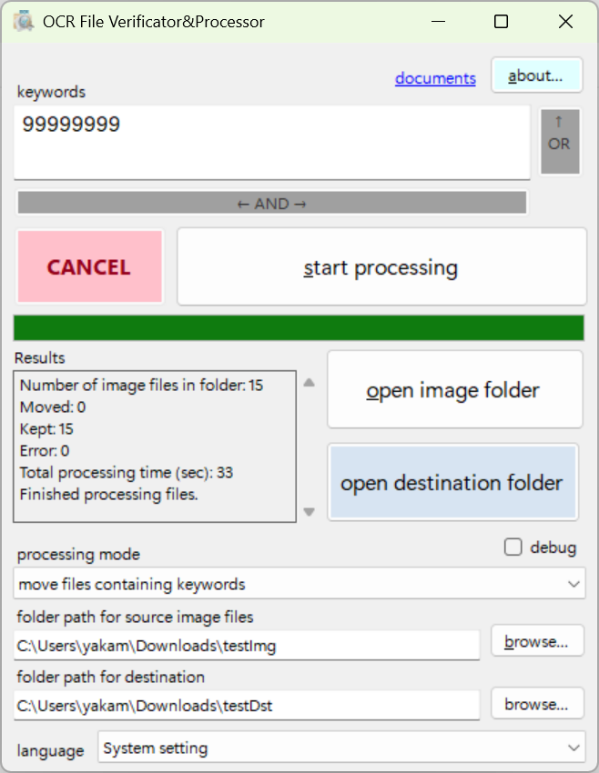

⬇️ [最新版インストーラーのダウンロード](releases/latest)

## ocrFileVeriProc

`ocrFileVeriProc` OCRファイル検証・処理ツールは、
画像ファイル（PNG, JPG, JPEG, BMP）に対してOCR処理を行い、
指定したキーワードに基づいてファイルの検証・移動・削除を自動化する
Windowsアプリケーションです。
Tesseract OCRとOpenCVを利用し、複数言語・並列処理・
高度な画像前処理（Deskew, 二値化）に対応しています。

## 主な機能
- OCRによる画像ファイルのテキスト抽出
- キーワード一致によるファイルの検証・移動・削除
- 検証モード（キーワード一致/不一致で判定）
- 移動モード（キーワード一致/不一致で指定フォルダへ移動）
- 削除モード（キーワード一致/不一致で削除）
- 画像のDeskew（二値化・傾き補正）処理
- 並列処理による高速化
- 多言語UI対応（日本語含む）

## 使い方
1. 対象画像フォルダを指定
2. 処理モード（検証・移動・削除）を選択
3. 必要に応じて移動先フォルダを指定
4. キーワードを入力（複数行可(OR)、行内にスペース区切りで複数キーワード指定可(AND)）
5. [開始]ボタンで処理を実行

## 必要環境
- Windows 10/11
- .NET Framework 4.8
- Tesseract OCR（同封）
- OpenCVSharp（同封）

## インストール時の注意
本ソフトは個人開発の未署名アプリであるため、
実行時に Windows SmartScreen によって
「Windows によって PC が保護されました」という警告が表示される場合があります。
その場合は、**「詳細情報」** をクリックした後に表示される
**「実行」** ボタンを押すことでインストール・起動が可能です。

## UI言語
|コード|日本語名|当該言語での言語名|
|----|----|----|
|ar|アラビア語|العربية|
|bn|ベンガル語|বাংলা|
|de|ドイツ語|Deutsch|
|en|英語|English|
|es|スペイン語|Español|
|fa|ペルシア語|فارسی|
|fr|フランス語|Français|
|hi|ヒンディー語|हिन्दी|
|id|インドネシア語|BahasaIndonesia|
|it|イタリア語|Italiano|
|ja|日本語|日本語|
|jv|ジャワ語|BasaJawa|
|ko|韓国語|한국어|
|mr|マラーティー語|मराठी|
|ms|マレー語|BahasaMelayu|
|pa|パンジャーブ語|ਪੰਜਾਬੀ|
|pcm|ナイジェリア・ピジン語|NigerianPidgin|
|pt|ポルトガル語|Português|
|ru|ロシア語|Русский|
|sw|スワヒリ語|Kiswahili|
|ta|タミル語|தமிழ்|
|te|テルグ語|తెలుగు|
|th|タイ語|ไทย|
|tr|トルコ語|Türkçe|
|uk|ウクライナ語|Українська|
|ur|ウルドゥー語|اردو|
|vi|ベトナム語|TiếngViệt|
|zh_Hans|中国語（簡体字）|简体中文|
|zh_Hant|中国語（繁体字）|繁體中文|

## スキャン言語
|Lang Code|Language|4.0 traineddata|
|----|----|----|
|afr|Afrikaans|afr.traineddata|
|amh|Amharic|amh.traineddaa|
|ara|Arabic|ara.traineddata|
|asm|Assamese|asm.traineddata|
|aze|Azerbaijani|aze.traineddata|
|aze_cyrl|Azerbaijani - Cyrillic|aze_cyrl.traineddata|
|bel|Belarusian|bel.traineddata|
|ben|Bengali|ben.traineddata|
|bod|Tibetan|bod.traineddata|
|bos|Bosnian|bos.traineddata|
|bul|Bulgarian|bul.traineddata|
|cat|Catalan; Valencian|cat.traineddata|
|ceb|Cebuano|ceb.traineddata|
|ces|Czech|ces.traineddata|
|chi_sim|Chinese - Simplified|chi_sim.traineddata|
|chi_tra|Chinese - Traditional|chi_tra.traineddata|
|chr|Cherokee|chr.traineddata|
|cym|Welsh|cym.traineddata|
|dan|Danish|dan.traineddata|
|deu|German|deu.traineddata|
|dzo|Dzongkha|dzo.traineddata|
|ell|Greek, Modern (1453-)|ell.traineddata|
|eng|English|eng.traineddata|
|enm|English, Middle (1100-1500)|enm.traineddata|
|epo|Esperanto|epo.traineddata|
|est|Estonian|est.traineddata|
|eus|Basque|eus.traineddata|
|fas|Persian|fas.traineddata|
|fin|Finnish|fin.traineddata|
|fra|French|fra.traineddata|
|frk|German Fraktur|frk.traineddata|
|frm|French, Middle (ca. 1400-1600)|frm.traineddata|
|gle|Irish|gle.traineddata|
|glg|Galician|glg.traineddata|
|grc|Greek, Ancient (-1453)|grc.traineddata|
|guj|Gujarati|guj.traineddata|
|hat|Haitian; Haitian Creole|hat.traineddata|
|heb|Hebrew|heb.traineddata|
|hin|Hindi|hin.traineddata|
|hrv|Croatian|hrv.traineddata|
|hun|Hungarian|hun.traineddata|
|iku|Inuktitut|iku.traineddata|
|ind|Indonesian|ind.traineddata|
|isl|Icelandic|isl.traineddata|
|ita|Italian|ita.traineddata|
|ita_old|Italian - Old|ita_old.traineddata|
|jav|Javanese|jav.traineddata|
|jpn|Japanese|jpn.traineddata|
|kan|Kannada|kan.traineddata|
|kat|Georgian|kat.traineddata|
|kat_old|Georgian - Old|kat_old.traineddata|
|kaz|Kazakh|kaz.traineddata|
|khm|Central Khmer|khm.traineddata|
|kir|Kirghiz; Kyrgyz|kir.traineddata|
|kor|Korean|kor.traineddata|
|kur|Kurdish|kur.traineddata|
|lao|Lao|lao.traineddata|
|lat|Latin|lat.traineddata|
|lav|Latvian|lav.traineddata|
|lit|Lithuanian|lit.traineddata|
|mal|Malayalam|mal.traineddata|
|mar|Marathi|mar.traineddata|
|mkd|Macedonian|mkd.traineddata|
|mlt|Maltese|mlt.traineddata|
|msa|Malay|msa.traineddata|
|mya|Burmese|mya.traineddata|
|nep|Nepali|nep.traineddata|
|nld|Dutch; Flemish|nld.traineddata|
|nor|Norwegian|nor.traineddata|
|ori|Oriya|ori.traineddata|
|pan|Panjabi; Punjabi|pan.traineddata|
|pol|Polish|pol.traineddata|
|por|Portuguese|por.traineddata|
|pus|Pushto; Pashto|pus.traineddata|
|ron|Romanian; Moldavian; Moldovan|ron.traineddata|
|rus|Russian|rus.traineddata|
|san|Sanskrit|san.traineddata|
|sin|Sinhala; Sinhalese|sin.traineddata|
|slk|Slovak|slk.traineddata|
|slv|Slovenian|slv.traineddata|
|spa|Spanish; Castilian|spa.traineddata|
|spa_old|Spanish; Castilian - Old|spa_old.traineddata|
|sqi|Albanian|sqi.traineddata|
|srp|Serbian|srp.traineddata|
|srp_latn|Serbian - Latin|srp_latn.traineddata|
|swa|Swahili|swa.traineddata|
|swe|Swedish|swe.traineddata|
|syr|Syriac|syr.traineddata|
|tam|Tamil|tam.traineddata|
|tel|Telugu|tel.traineddata|
|tgk|Tajik|tgk.traineddata|
|tgl|Tagalog|tgl.traineddata|
|tha|Thai|tha.traineddata|
|tir|Tigrinya|tir.traineddata|
|tur|Turkish|tur.traineddata|
|uig|Uighur; Uyghur|uig.traineddata|
|ukr|Ukrainian|ukr.traineddata|
|urd|Urdu|urd.traineddata|
|uzb|Uzbek|uzb.traineddata|
|uzb_cyrl|Uzbek - Cyrillic|uzb_cyrl.traineddata|
|vie|Vietnamese|vie.traineddata|
|yid|Yiddish|yid.traineddata|

## ライセンス
専用ライセンス（Proprietary License）
詳細は `documents/Lisence.ja.txt` をご参照ください。

## 作者
minipoisson

